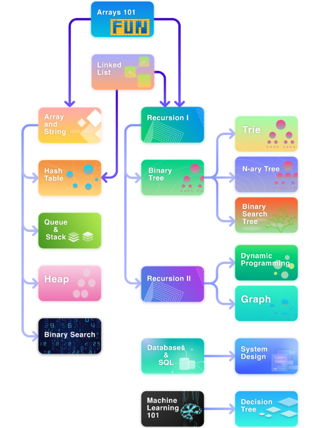

# ExplorerTech

## Learning Path 

### [Array](/ExplorerTech/Array/) 

* ***Language:*** Use `Java` for most (I'll add `C`,`Python` as prac)

> *Go to: [`Array and String`](#array-and-string), [`Recursion I`](#recursion-i)*

### [Link List](/ExplorerTech/Link%20List/)

* ***Language:*** Use `Java`, `C++` for most (I'll add `C`,`Python` as prac)

> *Go to: [`Hash Table`](#hash-table), [`Recursion I`](#recursion-i)*

### [Array and String](/ExplorerTech/Array%20and%20String/)

* ***Language:*** Use `Java`, `C++` for most (I'll add `C`,`Python` as prac)

> *Go to: [`Hash Table`](#hash-table), `Queue & Stack`, `Heap`, `Binary Search`*

### [Recursion I](/ExplorerTech/Recursion%20I/)

* ***Language:*** Use `Java`, `C++` for most (I'll add `C`,`Python` as prac)

> *Go to: `Binary Tree`, `Recursion II`*

### [Hash Table](/ExplorerTech/Hash%20Table/)

* ***Language:*** Use `Java`, `C++` for most (I'll add `C`,`Python` as prac)